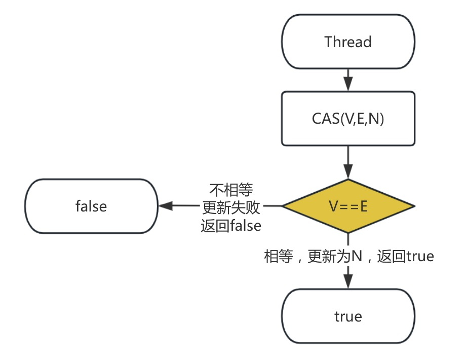
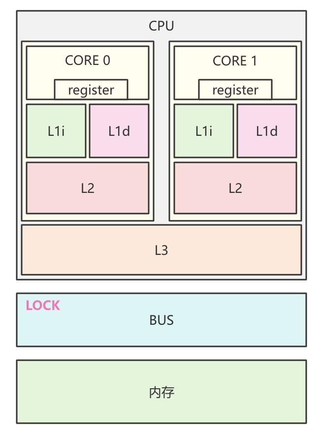
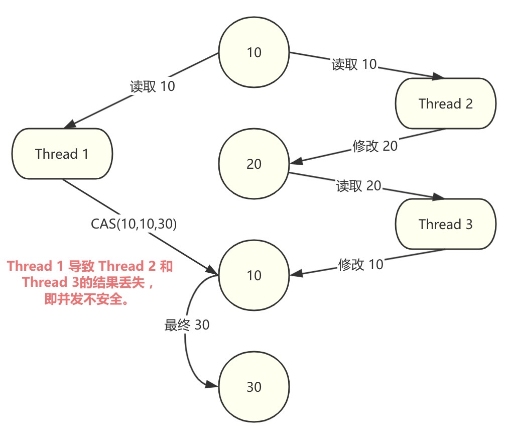

# CAS : Compare And Swap

### 一、概念
顾名思义，叫作比较交换，是一种无锁原子算法，乐观锁实现，并发安全，由硬件指令完成，不会阻塞，不会切换上下文。用于并发安全快速更新变量值。
```shell
CAS(V,E,N)
# V:value, 原变量的值
# E:expectation,  原变量的期望值
# N:new, 新值
```
<div align="center"></div>

### 二、原理
调用CPU指令集cmpxchg完成，多核情况下，CPU靠锁定缓存或总线完成。
###### 缓存锁
处理器对缓存行数据进行锁定，根据MESI缓存一致性，致使其他处理器缓存失效，且不能修改被锁定的内存数据。
```
1、处理器不支持缓存，则使用总线锁。
2、数据没被缓存或跨多行缓存，则使用总线锁。
```
###### 总线锁
指给总线加锁，阻塞其他处理器。
<div align="center"></div>

### 三、问题
###### ABA
即A——>B——>A，解决办法，添加版本号，1A——>2B——>3A。
<div align="center"></div>

###### 自旋锁
线程获取锁失败，自旋等待锁释放，如果锁一直没被释放，或被其他线程抢占，线程会一直自旋，造成资源浪费。解决办法，限制自旋次数。