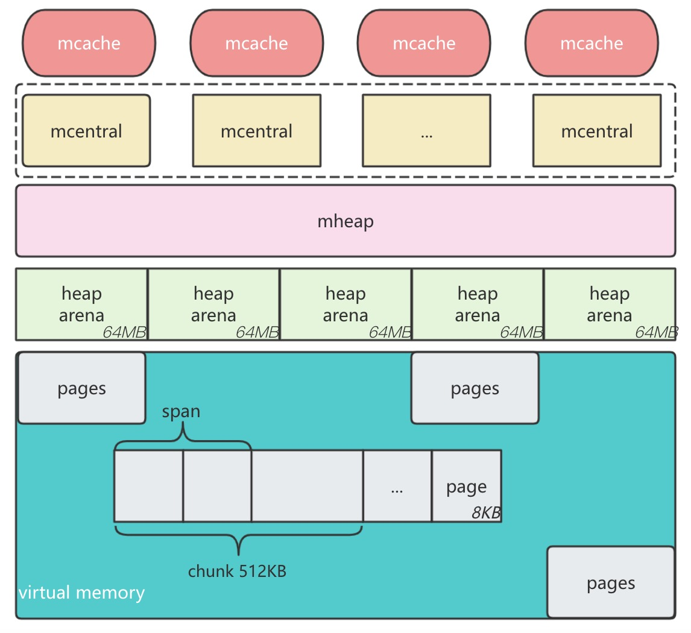
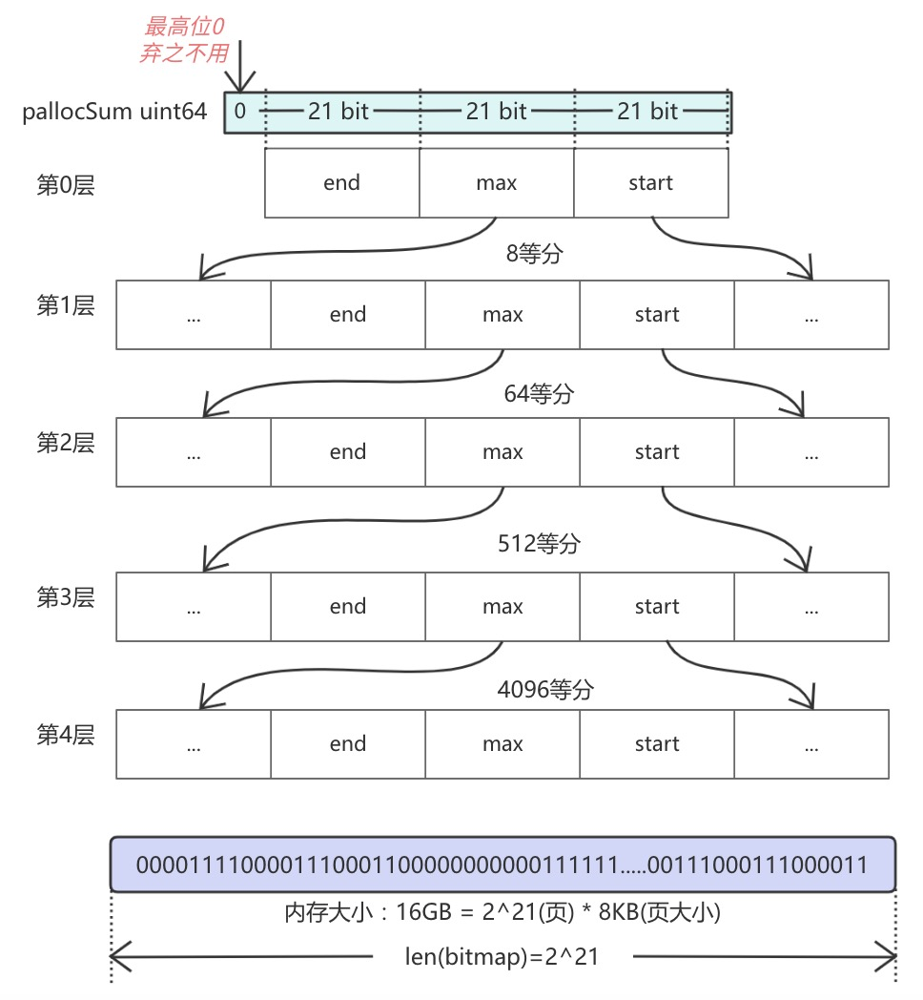
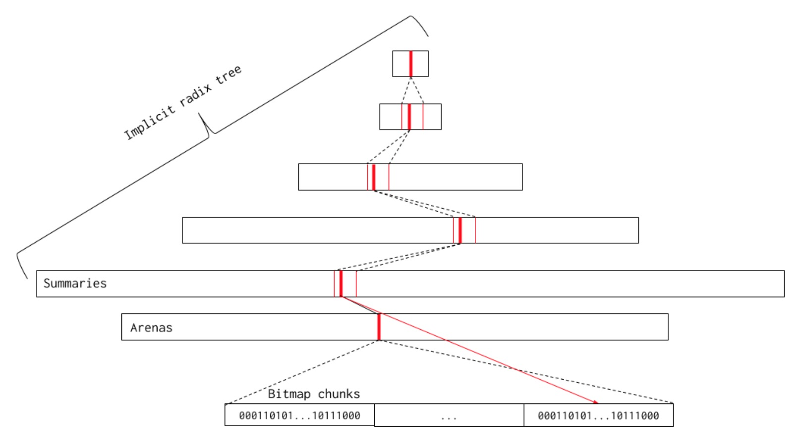
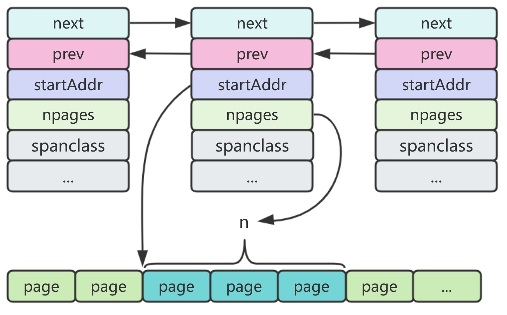

# Memory

### 概念
借鉴tcmalloc思路设计，目的：减少系统调用，减少内存碎片，避免上下文切换，避免锁竞争。
### 结构
<div align="center"></div>
全局堆内存被分为一个个的arena 64MB，每个arena是一段连续的内存，被分为8192个page 8KB，连续的page组成一个span，chunk用于page管理。<br/>
整个堆内存由mheap结构管理，一个arena对应一个heapArena结构，一个span对应一个mspan结构，预置内存被分为67种（内存对齐），从8B~32KB。一个mcentral结构管理一种类型的mspan，除内置的67种外还包括>32KB的类型，即68种类型，根据是否扫描被分为scan和noscan类型，共计136种（68 * 2 = 136）。

#### page
最小存储单元，8K，源于操作系统的分页管理，根据CPU位数取值，8位（1KB）、16位（2KB）、32位（4KB）、64位（8KB）。目前以page为单位的缓存设计思路已深得人心，特别是CPU架构均带有缓存，目的是对数据的最大化读取，最小化交换。
#### chunk
内存块，逻辑概念，将每64个page视为一个内存块，并用位图标记其使用情况，这样便于分配和回收时的快速索引。一个chuck大小为64*8=512KB，一个chunk对应一个pallocData结构，管理page分配和回收情况，`pageBits [8]uint64`是page分配/回收的位图，所有的chunk都由pageAlloc管理。
<div align="center"></div>

#### pageAlloc
页面分配器，即是page管理的数据结构。用于page的分配和重复利用，主要包含chunk的管理和基数树算法。<br/>
字段`chunks`是chunk位图切片，二级离散数组结构，用于管理chunk。
<div align="center"></div>

`summary [5][]pallocSum`是基数树算法的数据结构，5层，用于快速定位连续空闲空间大小，每个切片的容量代表预留内存，长度代表该层已知堆分配地址。pallocSum是树的一个节点。每层按8的倍数增加。
<div align="center"></div>

`pallocSum uint64`包含`start, max, end uintptr`，表示一个块前中后存在连续空闲空间大小，start表示该位图分片开头的连续 0 bit的数量。类似地，end表示位图分片末尾的连续 0 bit的数量。最后，max表示位图分片中最大的连续 0 bit部分。 
<div align="center"></div>
拿叶子节点来说：
<div align="center"></div>
基数树主要解决从堆分配时频繁加锁问题。使用位图跟踪可用内存，是管理线性的地址空间的位图结构。
基数树共有五层，第一层有 2^14 个节点，因此共用 2^14棵基数树，总空间大小为 2^14*16GB = 256T，接下来每层的节点数为上层的 8 倍。
<div align="center"></div>

基数树的提案[参考](https://go.googlesource.com/proposal/+/master/design/35112-scaling-the-page-allocator.md)

#### spanClass
内存单元等级，为对抗内存碎片化，Go预置67种类型的内存等级1-67，从8B~32KB，还有一种等级为0的类型，用于大对象存储。需要分配内存时，分配器会根据对象大小找到最匹配的等级。

| class | bytes/obj | bytes/span | objects | tail waste | max waste | min align |
|------:|----------:|-----------:|--------:|-----------:|----------:|----------:|
|     1 |         8 |       8192 |    1024 |          0 |    87.50% |         8 |
|     2 |        16 |       8192 |     512 |          0 |    43.75% |        16 |
|     3 |        24 |       8192 |     341 |          8 |    29.24% |         8 |
|     4 |        32 |       8192 |     256 |          0 |    21.88% |        32 |
|     5 |        48 |       8192 |     170 |         32 |    31.52% |        16 |
|     6 |        64 |       8192 |     128 |          0 |    23.44% |        64 |
|   ... |       ... |        ... |     ... |        ... |       ... |       ... |
|    66 |     28672 |      57344 |       2 |          0 |     4.91% |      4096 |
|    67 |     32768 |      32768 |       1 |          0 |    12.50% |      8192 |

如上所示，第一级元素大小为8字节，span的大小为8192字节，因此第一级中每一个span拥有8192/8 = 1024个。每一个span的大小和span中元素的个数都不是固定的，例如66级别的span大小为57344字节，每一个对象为28672字节，元素个数为2个。Span大小虽然不固定，但其是8K或更大的连续内存区域。
<div align="center"></div>
spanClass主要用于储存span的使用情况，uint8类型，高7位储存等级的编号，最低位表示是否需要GC扫描，0包含指针的需要扫描，1不含指针的不需要扫描。
<div align="center"></div>

#### mspan
最小的管理单元，page的整数倍，由spanClass可知，span共(1+67)*2=136种，每种等级的span由全局的mcentral管理，双向链表连接。
<div align="center"></div>

```
type mspan struct {
    ...
    startAddr  uintptr       // span管理的内存起始地址
    npages     uintptr       // 页数量
    nelems     uintptr       // 存储对象的最大数量，参考sizeclass.go表格
    freeindex  uintptr       // 对象的槽索引，0～nelems之间，用于快速扫描下一个空闲对象空间
    allocCache uint64        // allocBits在freeindex的缓存位图，保存了allocBits补集，因此CTZ算法能快速找到下一个空闲对象
    allocBits  *gcBits       // 分配标记位图 gcBits{x uint8}
    gcmarkBits *gcBits       // GC标记位图 gcBits{x uint8}
    spanclass  spanClass     // 类型
    state      mSpanStateBox // 状态，mSpanDead(已释放)、mSpanInUse(使用中)、mSpanManual(Stack)、mSpanFree(空闲)，真实内存状态
}
```
#### heapArena
arena是堆内存单元，64位linux系统下64MB，Go向系统申请内存的单位，heapArena记录arena的元数据，每个 heapArena 包含 8192 个页，大小为 8192 * 8KB = 64 MB，记录了page到mspan的映射。由mheap结构管理。
<div align="center"></div>

|        Platform |  Addr bits |  Arena size |  L1 entries |   L2 entries |
|----------------:|-----------:|------------:|------------:|-------------:|
|        */64-bit |         48 |        64MB |           1 |    4M (32MB) |
|  windows/64-bit |         48 |         4MB |          64 |    1M  (8MB) |
|       ios/arm64 |         33 |         4MB |           1 |  2048  (8KB) |
|        */32-bit |         32 |         4MB |           1 |  1024  (4KB) |
|      */mips(le) |         31 |         4MB |           1 |   512  (2KB) |

`bitmap [heapArenaBitmapWords]uintptr` 位图，高4位存储4个扫描/终止位,低4位存储4个指针/标量位，
```
// 64位的Linux系统
heapArenaBytes = 67108864 //一个heapArena是64MB 
heapArenaWords = heapArenaBytes / 8 // 一个heapArena有8M个word，一个word占8个字节 
heapArenaBitmapWords = heapArenaWords / (8 * goarch.PtrSize) // 8M/64=131072，即128K 
```
<div align="center"></div>
例如在arena起始处分配一个slice，slice结构包括一个元素指针，一个长度，以及一个容量。
<div align="center"></div>

`pageInUse [pagesPerArena / 8]uint8` 位图，8192位，标记span状态是mSpanInUse，只标记span的第一个page。对于堆中的一个指针p，可以通过 `pageIdx = ((p / pageSize) / 8) % uintptr(len(arena.pageInUse))` 找到对应的页索引。
<div align="center"></div>

#### mcentral
span的全局管理对象，每个规格的mcentral包含一种规格的span，136个，每个mcentral对象中，span被整理成已用尽和未用尽两类， `partial [2]spanSet` 未用尽，`full [2]spanSet` 已用尽，数组分为已清扫和未清扫两种。
<div align="center"></div>

在spanSet中，`spine` 是指向内存块组的指针，结构为`*[N]atomic.Pointer[spanSetBlock]`，每个spanSetBlock是一个mspan指针数组，包含512个mspan，由全局的`spanSetBlockPool`对象管理，简称块， `index` 是uint64类型数字的地址，记录块和mspan的使用情况，分为head和tail，不准确的说，head表示已使用的块数量，tail表示已使用的mspan数量，`head/512`或`tail/512`得到块所在位置，`head%512`或`tail%512`得到mspan具体位置。

#### mcache
线程缓存，包括小对象缓存和本地分配状态，绑定在本地P上，访问无需加锁，目的是加速线程对内存的访问。字段`tiny uintptr` 是指向堆内存微小对象块的指针，用于标记微小对象内存情况，`alloc [numSpanClasses]*mspan` 缓存136个span，每种 spanClass 各一个。
<div align="center"></div>

#### mheap
全局堆内存管理中心。
```
type mheap struct {
    // ...
    lock mutex
    pages pageAlloc
	allspans []*mspan
	arenas [1 << arenaL1Bits]*[1 << arenaL2Bits]*heapArena
	curArena struct {
		base, end uintptr
	}
	central [numSpanClasses]struct {
		mcentral mcentral
		pad      [cpu.CacheLinePadSize - unsafe.Sizeof(mcentral{})%cpu.CacheLinePadSize]byte
	}
}
```

### 分配
### 回收